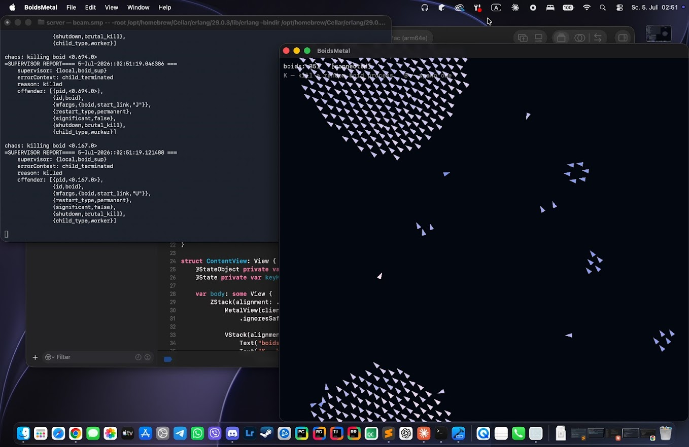

# Boids: Erlang backend + Swift/Metal frontend

[](https://github.com/sponsors/makarov-mm)
[](LICENSE)


[](https://www.linkedin.com/in/makarov-mm/)
[](https://www.threads.net/@m.m.makarov)
[](https://www.instagram.com/m.m.makarov/)

Craig Reynolds' boids where the simulation and the renderer are two separate
programs - deliberately in two opposite paradigms.

## Screenshot


The **server** is an Erlang node: every boid is an isolated process
(`gen_server`) under a `simple_one_for_one` supervisor. No shared memory -
the flock exists only as messages passing between processes.

The **client** is a macOS app: Metal instanced rendering fed by binary
frames over TCP. Press a key to kill a random boid process on the server
and watch the supervisor restart it - the boid visibly teleports, the
flock never notices.

Zero external dependencies on both sides: pure OTP, pure
Metal / MetalKit / Network.framework.

```
┌────────────────────────────┐        ┌───────────────────────────┐
│  server/  (Erlang node)    │  TCP   │  client/  (macOS app)     │
│  boid_sup                  │ ─────► │  FlockClient (Network)    │
│   ├─ boid #1 (gen_server)  │ 60 Hz  │  Renderer (Metal,         │
│   ├─ boid #2               │ frames │   instanced triangles)    │
│   └─ ...                   │ ◄───── │  keys: K=chaos, B=spawn   │
│  flock_server (gen_tcp)    │  cmds  │                           │
└────────────────────────────┘        └───────────────────────────┘
```

## Layout

```
server/   boid.erl          one boid = one supervised gen_server
          boid_sup.erl      simple_one_for_one supervisor
          flock_server.erl  gen_tcp server, tick loop, commands
client/   BoidsMetalApp.swift   SwiftUI shell, HUD
          FlockClient.swift     TCP client, frame parsing, keyboard
          Renderer.swift        Metal instanced rendering
          Shaders.metal         vertex rotation by heading, speed color
          build.zsh             builds BoidsMetal.app without Xcode
```

## Wire protocol

Little-endian, one frame per tick:

```
frame = count :: uint32
      , count * { x, y, vx, vy } :: 4 * float32     (16 bytes per boid)
```

The layout matches MSL `float4` exactly, so the client memcpy's the payload
straight into the Metal instance buffer. No parsing, no conversion.

Commands from client to server, single bytes:
`0x01` chaos (kill a random boid process), `0x02` spawn one more.

Coordinates are normalized to `[0,1] x [0,1]`; the renderer letterboxes.

## Run

Server (Erlang/OTP 25+, `brew install erlang`):

```zsh
cd server
mkdir -p ebin
erlc -o ebin *.erl
erl -pa ebin -noshell -eval "flock_server:start(200, 4040)"
```

Client (Command Line Tools are enough, full Xcode not required):

```zsh
cd client
./build.zsh
open build/BoidsMetal.app
```

The build script compiles the Metal shaders offline when the `metal`
compiler is available (full Xcode); with Command Line Tools only, it ships
`Shaders.metal` as a resource and the app compiles it at runtime.

## Keys

| Key | Effect |
|-----|--------|
| K   | `exit(Pid, kill)` on a random boid process. The supervisor restarts it within microseconds at a random position - population stays the same. |
| B   | Spawn one more boid; the frame size adapts automatically. |

Note the OTP distinction the demo makes visible: a *crash* (K) never
changes the population, because a `permanent` child is always restarted.
Removing a boid would be an administrative operation
(`supervisor:terminate_child/2`) - a different thing than killing it.

Fault tolerance here is not a feature of the application code - nothing in
`boid.erl` handles being killed. It is a property of the runtime.

## License

MIT License

Copyright (c) 2026 Mykhailo Makarov

Permission is hereby granted, free of charge, to any person obtaining a copy
of this software and associated documentation files (the "Software"), to deal
in the Software without restriction, including without limitation the rights
to use, copy, modify, merge, publish, distribute, sublicense, and/or sell
copies of the Software, and to permit persons to whom the Software is
furnished to do so, subject to the following conditions:

The above copyright notice and this permission notice shall be included in all
copies or substantial portions of the Software.

THE SOFTWARE IS PROVIDED "AS IS", WITHOUT WARRANTY OF ANY KIND, EXPRESS OR
IMPLIED, INCLUDING BUT NOT LIMITED TO THE WARRANTIES OF MERCHANTABILITY,
FITNESS FOR A PARTICULAR PURPOSE AND NONINFRINGEMENT. IN NO EVENT SHALL THE
AUTHORS OR COPYRIGHT HOLDERS BE LIABLE FOR ANY CLAIM, DAMAGES OR OTHER
LIABILITY, WHETHER IN AN ACTION OF CONTRACT, TORT OR OTHERWISE, ARISING FROM,
OUT OF OR IN CONNECTION WITH THE SOFTWARE OR THE USE OR OTHER DEALINGS IN THE
SOFTWARE.

## License

MIT License

Copyright (c) 2026 Mykhailo Makarov

Permission is hereby granted, free of charge, to any person obtaining a copy
of this software and associated documentation files (the "Software"), to deal
in the Software without restriction, including without limitation the rights
to use, copy, modify, merge, publish, distribute, sublicense, and/or sell
copies of the Software, and to permit persons to whom the Software is
furnished to do so, subject to the following conditions:

The above copyright notice and this permission notice shall be included in all
copies or substantial portions of the Software.

THE SOFTWARE IS PROVIDED "AS IS", WITHOUT WARRANTY OF ANY KIND, EXPRESS OR
IMPLIED, INCLUDING BUT NOT LIMITED TO THE WARRANTIES OF MERCHANTABILITY,
FITNESS FOR A PARTICULAR PURPOSE AND NONINFRINGEMENT. IN NO EVENT SHALL THE
AUTHORS OR COPYRIGHT HOLDERS BE LIABLE FOR ANY CLAIM, DAMAGES OR OTHER
LIABILITY, WHETHER IN AN ACTION OF CONTRACT, TORT OR OTHERWISE, ARISING FROM,
OUT OF OR IN CONNECTION WITH THE SOFTWARE OR THE USE OR OTHER DEALINGS IN THE
SOFTWARE.

## Support

If you found this project interesting or useful, you can support my work:

[](https://github.com/sponsors/makarov-mm)
